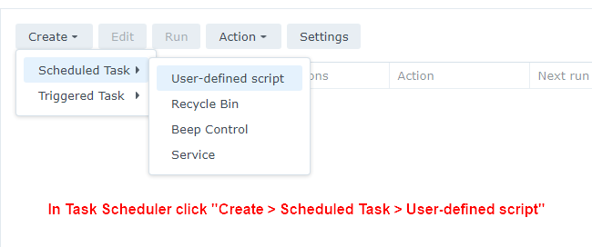
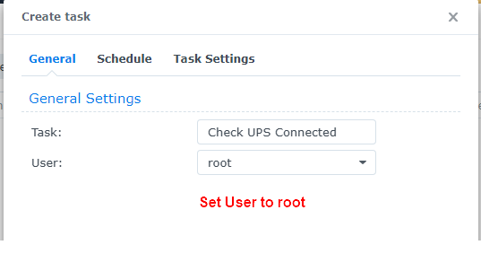
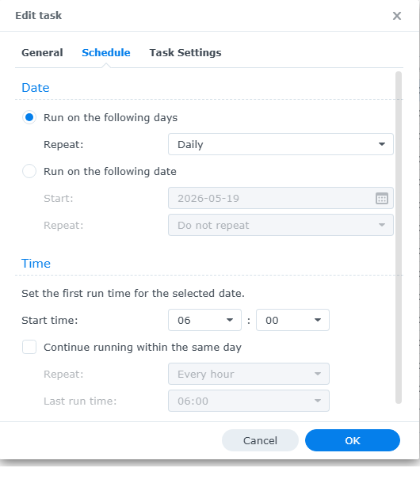
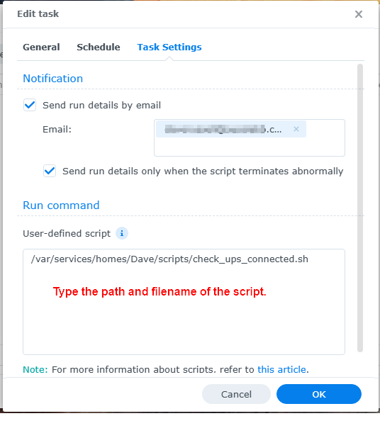

# How to schedule the script in Synology Task Scheduler

To schedule the script in Task Scheduler follow these steps:

1. Go to **Control Panel** > **Task Scheduler** > click **Create** > and select **Scheduled Task**.
2. Select **User-defined script**.
3. Enter a task name.
4. Select **root** as the user (The script needs to run as root).
5. Click **Schedule** and set a schedule.
6. Click **Task Settings**.
7. Tick **Send run details by email** and enter your email address.
8. Tick **Send run details only when the script terminates abnormally** if you only want to recieve emails when the UPS is not connected.
9. In the box under **User-defined script** type the path to the script. 
    - e.g. If you saved the script to a shared folder on volume 1 called "scripts" you'd type: **/volume1/scripts/check_ups_connected.sh**
10. Click **OK** to save the settings.

**Here's some screenshots showing what needs to be set:**

Step 1

Step 2

Step 3

Step 4

